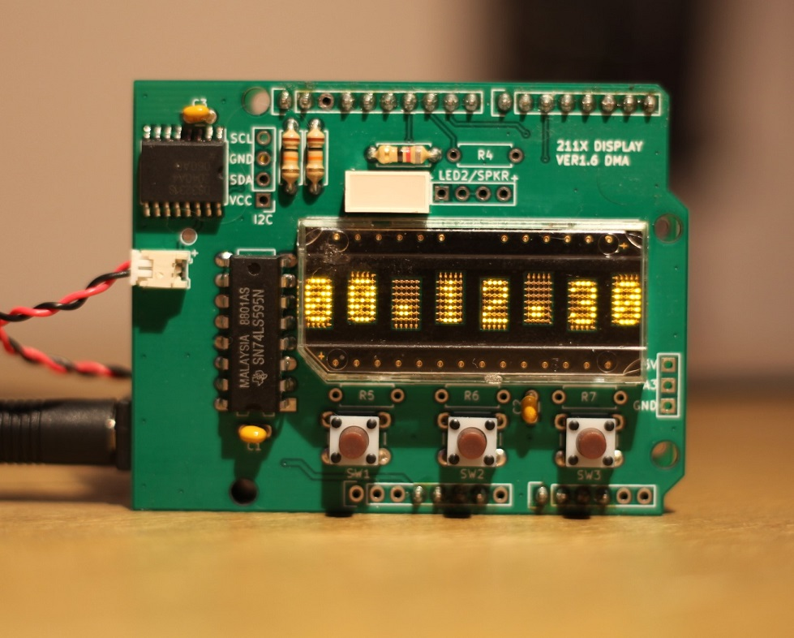

# HDSP 211x LED Display Shield
 An HDSP 211x LED display shield for the Arduino Uno R3. This display uses a HDSP led character display and a 74HC595
 8 bit shift register to reduce the amount of pins. The shield also has spots for 3 tactile buttons, extra indication
 LED's, and a DS3231 i2c RTC clock. One of the LED's can be substituted for a piezo buzzer.
 
 There are 4 different display choices to choose from.
 
 |  COLOR  |  PART NO.  |
 |---------|------------|
 | ORANGE  | HDSP-2110  |
 | YELLOW  | HDSP-2111  |
 | RED     | HDSP-2112  |
 | GREEN   | HDSP-2113  |
 
 And there are 3 LED bar indicators to choose.
 
 |  COLOR  |  PART NO.  |
 |---------|------------|
 | RED     |  HLMP-2300 |
 | YELLOW  |  HLMP-2400 |
 | GREEN   |  HLMP-2500 |
 
 Optional parts for RTC clock.
 
 |   REF   |  PART NO.  |
 |---------|------------|
 |   U2    |  DS3231M   |
 |   C3    |  100nF CER |
 |   J2    | 53048-0210 |
 | SW1,2,3 |TL1105CF100Q|
 |  R1,2   | 10k 1/4w   |
 
 NOTE!: This shield consumes about 500mA at full brightness so it is best to run the Arduino board from USB power.
 
 Output gerbers are Zipped up, current revision is Ver1.6 and Arduino demo code is located in the examples folder.
 
 